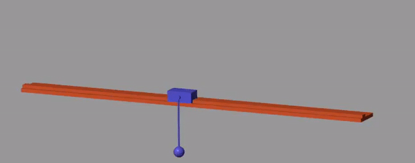
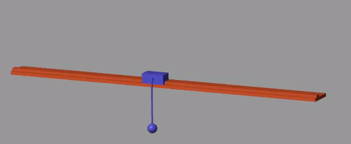

# simscapeInvertedPendulum
This repo demonstrates the control of an inverted pendulum. This system approximated as a linear system about the operating point (up-right vertical position). Control gains can either be chosen to satisfy desired closed loop system poles or can be choosen to minimze a cost function.

## Instructions
1. Set MATLAB directory to path containing all files in repo
2. Run the script titled: pendulumAssembly_DataFile1.m
3. Run the first section of the script titled: Script_SlidingPendulum.m
4. a) To choose feedback gains that satisfy desired closed loop poles requirements run the second section. You can change the desired poles by changing the values of the variable named 'eigs.'
4. b) To choose feedback gains that minimize a cost function, run the third section of Script_SlidingPendulum.m

## System Definition
The system has 4 states which are defined in the following order:
1. Linear Position of Cart
2. Linear Velocity of Cart
3. Angular Position of Pendulum
4. Angular Velocity of Pendulum

## Manual Pole Placement
The MATLAB function 'place' is used to select gains such that the feedback law u=K*(Xdesired-X) places the poles of the closed loop system at the locations specified by the variable 'eigs'

## Cost Function Minimization
The gains can also be calculated so that a cost function of system states is minimized with respect to some criteria. The cost function is specified as follows:
J=Q*Xerror+R*u. Q is a diagonal matrix containing weights for error in each state. R is chosen as a constant because this system only has one control input. The MATLAB function 'lqr' is used to determine the gain values.

## Effect of Q weights

## Animations

### Desired Operating Point at Middle of Slider

|                            High Weight for Cart Position                       |                            High Weight for Pendulum Position                    |
|:------------------------------------------------------------------------------:|:-------------------------------------------------------------------------------:|
|| |
